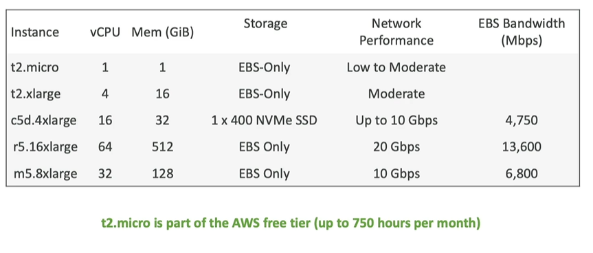
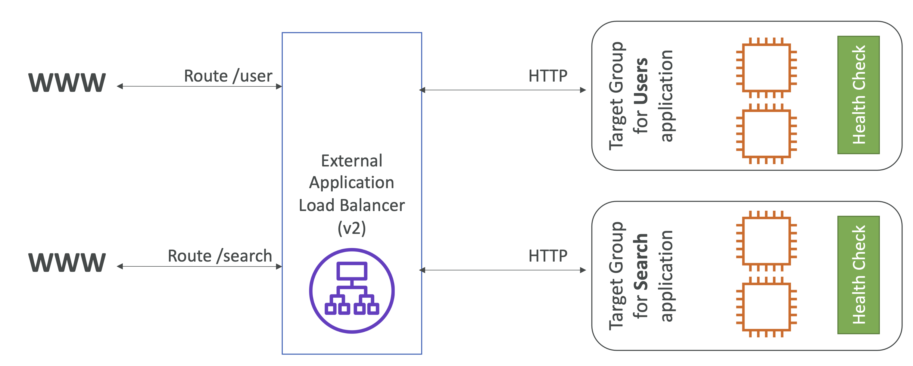
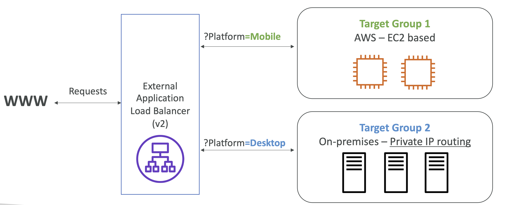
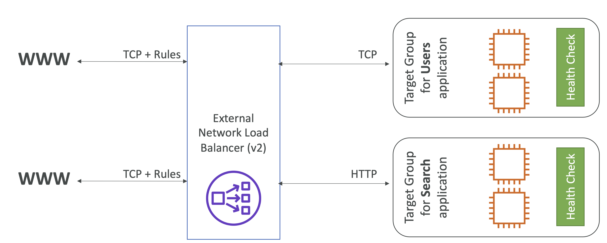
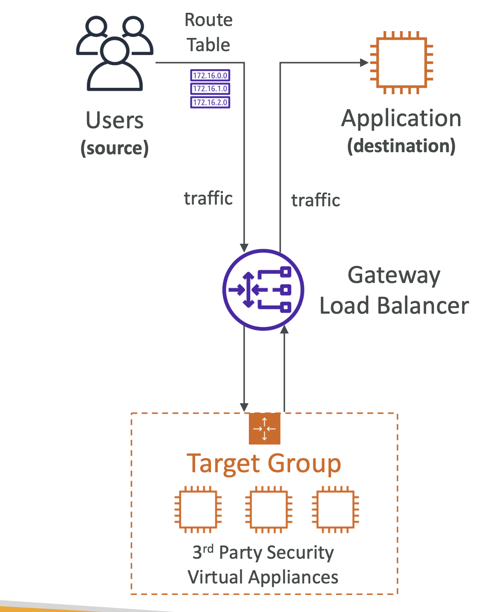
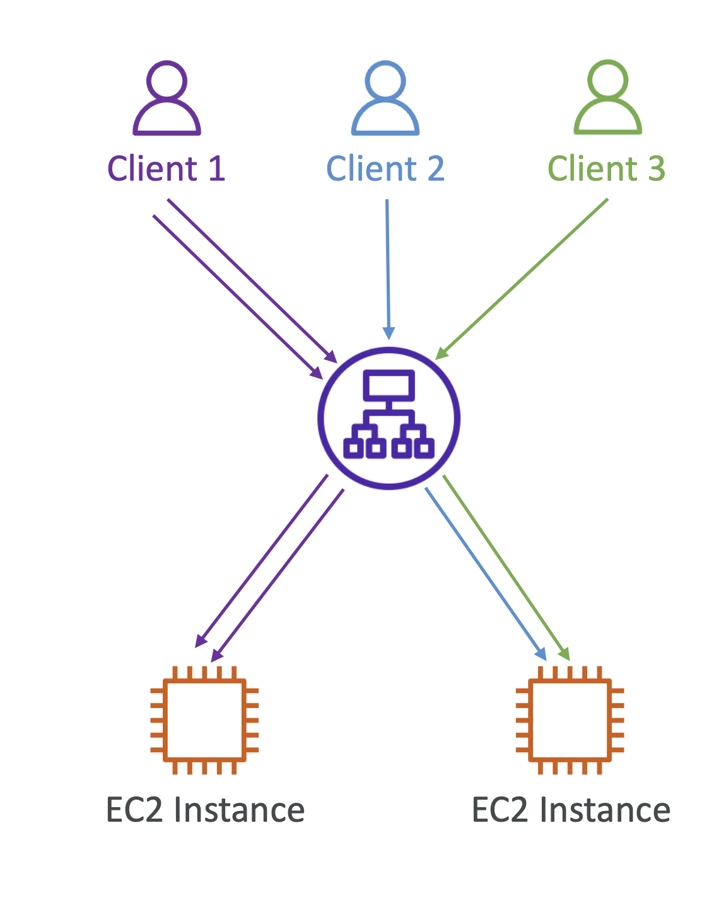
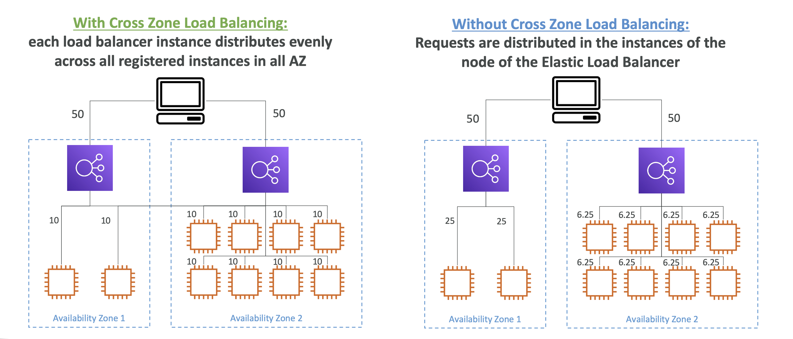

**AWS DVA - C02**

**AWS Cloud Overview**:

Factors affect choosing an AWS Region:
1. Compliance with data governance and legal requirements - data never leaves a region without permission.
2. Proximity to customers: reduces latency
3. Available services: not every new service  is available in every region	
4. Pricing: varies from region to region

AZs: each region has usually 3 AZs, 
- Each AZ is one or more data centers with redundant power, connectivity and network.
- Separate from each other, so isolated from disaster.
- They are connected with high bandwidth and ultra low latency.

Edge Locations: Points of Presence
- Content is delivered to end users using low latency.

> Choose the closest location to you in the course, using us-east-2: Ohio

---
***

# Section 4: IAM & AWS CLI

IAM  - Identity and Access Management, Global Service.

#### IAM Groups

Root account created by default, shouldn't be used or shared.
- Instead create users, users are people within your org, and can be grouped.
- Groups only contain user, cannot contain other groups.
    - Users don't have to belong to a group, and user can belong to multiple groups

Why do we create groups? coz we want to give permissions to the users in the group to use account/access somethings.

### IAM Permissions

- Users or Groups can be assigned JSON documents called **policies**.
- these policies define the permissions of the users.
> In AWS you apply the ***least privilege principle***: don't give more permissions than a user needs

Did Hands on User creations.

### IAM Policies Inheritance

Policy Structure:
- Consists of
    - version: policy lang version, always include "2012-10-17"
    - Id: an identifier of policy(Optional)
    - statement: one or more individual statements
- Statement consists of
    - sid: statement id
    - effect: allow/deny
    - principal: account/user/role to which this policy is applied to.
    - action: list of actions this policy allows or denies
    - resource: list of resources to which the actions applied to
    - condition: when this policy is in effect (Optional)

IAM Policies Hands On:

### IAM MFA Overview:

IAM Password Policy
- Strong password = high security.
In Aws we can set a password policy:
- set a min password length, require specific character types like numbers and special characters
- allow all IAM users to change their own passwords
- require users to change their password after some time(expiration like 90days) and preventing password re-use.

IAM MFA: 
- protect atleast root accounts and IAM users.
- MFA devices
    - virtual MFA: Google authenticator or authy.
    - Universal 2nd Factor (U2F) Security Key: YubiKeys
    - Hardware Key Fob MFA Device: like Gemalto
    - Hardware key Fob MFA Device for AWS Gov Cloud(US): provided by SurePassID

IAM MFA Hands On:

### IAM AWS Access Keys

to access AWS we have 3 options:

1. AWS Management Console - protected by password + MFA
1. AWS Command Line Interface (CLI) - protected by access keys
1. AWS Software Development Kit (SDK) - for code: protected by access key

- Access Keys are generated through AWS console
- Users manage their own access keys
- Access keys are secret, just like a password, do not share them.
- Access Key ID = username
- Secret Access Key = password

AWS CLI: a tool that enables you to interat with AWS Services using commands in your command-line shell.
- direct access to public apis of AWS Services.
- you can develop scrips to manage your resources. kinda alternate to using AWS Management Console.

AWS SDK:
- language specific API
- enables you to access and manage AWS Services programmatically.
- embedded within your application
- supports
    - sdks like java, python, js, go, node js etc
    - mobile sdks like adroid and java
    - iot device sdk like embedded c, Arduino

AWS CLI Hands on:

aws configure: command is used to configure

and to check/confirm configuration use aws configure list command

aws iam list-users command will give all users

AWS CloudShell: shell inside the Management Console 

### IAM Roles for AWS Services:
- some service will need to perform actions on your behalf.
- to do so, we will assign permissions to AWS Services with AWS IAM Roles.
- common roles like EC2 Instance Roles, Lambda Fuction Roles, Roles for CloudFormation.

IAM Roles hands on:

Created a IAM Role for EC2 and give permission as IAMReadOnlyPermission.

### IAM Security Tools

- IAM Credential Report (account level)
    - a report of list all your account's users and the status of their various credentials.

- IAM Access Advisor (user-level)
    - Access advisor shows the service prmissions granted to a user and when those services were last accessed/used.
    - we can use this info to revise the policies.

Security Tools hands on: 

credential report - is on the left hand side under access report, go there and download the report.

access advisor - go to the specific user and click on the access advisor, it will pop up all the permissions.

### IAM Guidelines and Best Practices

- Don't use the root account except for AWS account setup.
- One physical user = one AWS user.
- assign users to groups and assigne permissions to groups.
- create a strong password policy and use mfa
- create and use roles for giving permissions to AWS services
- use access keys for programmatic access (CLI/SDK)
- audit permissions of your account using IAM Credentials Report or IAM Access Advisor.
- Never share IAM users and Access Keys.

### IAM Shared Responsibility Model

AWS:

Infrastructure(global network security), configuration and vulnerability analysis, compliance validation.

User:

Users, groups, roles, policies management and monitoring.

enable mfa on all accounts, rotate all your keys often, use IAM tools to apply appropriate permissions.

analyze access patterns and review permissions

---
***

# Section 5: EC2 Fundamentals

### EC2 Basics

It is the most popular offering of AWS

EC2 = Elastic Compute Cloud = IaaS

mainly consists in the capability of:
- renting virtual machines (EC2)
- storing data on virtual drives (EBS)
- distributing load across machines (ELB)
- scaling the services using an auto scaling group (ASG)

**EC2 sizing and configuration options**:

- OS: Linux, windows or Mac OS
- How much compute power and cores (CPU)
- How much RAM
- how much storage space:
    - Network attached like EBS & EFS
    - hardware - EC2 instance store
- Network card: speed of the card, public IP address.
- firewall rules: security group
- bootstrap script - configure at first launch - EC2 user data.

**EC2 User Data**:

- it is possible to bootstrap our instance using an EC2 User data script.
- bootstrapping means launching commands when a machine starts.
- script is only run once at the instance first start
- Ec2 user data is used to automate boot tasks such as: installing updates, installing softwares, downloading common files from the internet...
- EC2 user data script runs with the root user.

EC2 instace types:

### Create a EC2 instance with EC2 User Data to have a website

follow the process to create an instance, start, stop and terminate

### EC2 Instance types overview

naming convention: m5.2xlarge

- m: instance class
- 5: generation (AWS Improves them over time)
- 2xlarge: size within the instance class

General Purpose: great for diversity of workloads such as web servers or code repositories.
- balance bw: compute, networking and memory.

Compute Optimized: great for compute-intensive tasks that require high performance processors/
- batch processing workloads, media transcoding, high performance web servers, ML, dedicated gaming servers.
- instance class starts with c

Memory Optimized: fast performance for workloads that process large data sets in memory

- use cases: high performance relational/non-relatinal dbs, in memory dbs optimized for BI
- name series start with R for ram, x1 and z1

Storage Optimized: great for storage intensive tasks that require high read and write access to large data sets on local storage.
- use cases: relational and nosql dbs, cache for in-memory dbs, high freq online transation processing (OLTP), 
- starts with i, d, or h1

### Intro to Security Groups

- fundamental of network security in AWS
- they control how the traffic is allowed in or out of our EC2 instances.
- SGs only contain allow rules
- SG rules can reference by IP or by securtiy group.
- SGs are like acting firewall for EC2 instances.
- they regulate: access to ports, authorized ip ranges - ipv4 and ipv6, control of inbound and outbound networks

Good to Know data:
- SGs can be attached to multiple instances.
- locked down to a region/VPC combination
- does live **outside** the EC2 - if traffic is blocked teh EC2 instance won't see it.
> its good to manintain one separate SG for SSH access.
- if your application is not accessible (time out), then it's asecurity group issue.
- if your application gives a "connection refused" error, then it's an application error or it's not launched
- By default all inbound traffic is blocked and all outboudn traffic is authorized

Classic ports ot know:
- 22: SSH - log into a linux instance
- 21: FTP - upload files into a file share
- 22: SFTP (Secure FTP) - upload files using ssh
- 80: HTTP - access unsecured websites
- 443: HTTPS - access secured websites
- 3389: RDP(Remote Desktop Protocol) - to login to a windows instance

Security Groups hands on:

- if there is a timeout, it's mostly coz of Instance SG.

### SSH Overview

Connect to SSH using Linux or Mac

During the creating/launching instance we have downloaded a key pair like EC2Tutorial.pem file.

go to the folder in the terminal where we have the EC2Tutorial.pem file, and type the command below:

ssh -i EC2Tutorial.pem ec2-user@18.116.81.233

here 18.116.81.233 is the public ip for the instance

May be you will get the errors as permissions required for the EC2Tutorial.pem file so use this command chmod 0400 EC2tutorial.pem to give permissions and then run the ssh command again then you will be able to connect.

#### Instance Connect

in the instance page there would be connect on the top click it and follow the process.

### EC2 Instance Roles 

Demo: while using the instance connect, we need to configure the credentials, we are not supposed to put credentials in there, so then we need the Roles.

To add IAM Role go to Action on top right corner in the instance page

Actions > Security > Modify IAM role

Now role is attached to the instance.

---
***

# Section 6: EC2 Instance Storage

### EBS Overview

Elastic Block Storage - EBS is a **network drive** you can attach to your instances while they run.
- It allows your instances to persist data, even after their temination.
- they can be only mounted to one instace at a time(at CCP Level) but can have multi-attach (at Dev, Sysops, Sol Architect level)
- EBS are bound to specific AZ.
- think of them as a network USB stick

EBS Volume: 
- It is a network drive (not a physical drive)  
    - It uses the network to communicate the instance, which means there might be a bit of latency.
    - It can be detached from an instance and attached to another one quickly.
- It's locked to an AZ.
    - an EBS Volume in us-east-1a cannot be attached to us-east-1b
    - to move a volume across, you first need to snapshot it.
- Have a provisioned capacity (size in GBs, and IOPS input/output operations per sec)
    - you get billed for the provisioned capacity and you can increase the capacity of the drive over time.

EBS - Delete on termination attribute (last to 2nd column)
- controls the EBS behaviour when an EC2 instance terminates
    - by default, the root EBS volume is deleted (attribute enabled - check box ticked)
    - by default, any other attached EBS volume is not deleted (attribute disabled - check box unchecked)
- this can be controlled by AWS console/ AWS CLI
- use case: preserve root volume when instance is terminated.

EBS Hands on 

On the instance page, go to storage and under the volume you can see the EBS attached to it, you can create a new one and attach via actions > attach volume, and check on instance page > storage > volume

Note: you can only attach to the same AZ of the instance, means instance and the Volume that you are gonna create should be in same volume

Deleting is click on the any volume, go to actions > delete volume

Delete on termination: on the storage on instance page, scroll to the end (last to 2nd option) delete on the termination, is yes for the default volume and others are no, i.e., if you terminate (Actions > Terminate instance ) the instance the volume that is attached by default is also terminated by the ones that we attached will not be terminated

### EBS Snapshots

- make a backup (snapshot) of EBS volume at a point of time.
- not necessary to detach the volume to take snapshot, but recommended
- Can copy snapshots across regions and AZs

EBS Snapshot features:

- EBS Snapshot Archive: move snapshot to archive tier - 75% cheaper - restoring take 24 to 72hrs
- Recycle bin for snapshots: set up rule to recover snapshot - specify retention from 1 day to 1 year
- Fast Snapshot Restore (FSR): force full initialization of snapshot no latency on first use- costly

EBS Snapshot hands on:

click on the volume > Actions > Create snapshot

Left side under the EBS > click on snapshots, you can see all the snapshots, right click on the snapshot then copy, now you can transfer this to any destination AZ

Actions > create volume from snapshots - we can create the volume based on snapshot in any AZ

on the top there would be Recycle bin click that and can set a rule for retention rule for EBS snapshot - we can recover it.

### AMI Overview
Amazon Machine Image

AMI are customization of EC2 instances.
- can add own software, os, configuration, moitoring ..
- faster boot/ configuration time coz all software is pre-packaged

AMIs are built for specific region and can be copied across regions.

You can launch EC2 instance from 
- pulic AMI: AWS provided
- your own: make and maintain by you
- AWS marketplace: some one else made and sells

AMI Process for EC2 instance:

- start an EC2 instance and customize it.
- stop the instance (data integrity)
- build an AMI - this will create an EBS snapshot
- Launch instance from other AMI (can launch in diff AZ)

AMI Hands on:

Create an instance > right click on the instance > image and templates > create image 

Left side unde Images > AMI - select the image that we created and top right there would be Launch Instance from AMI

or while creating the instance in the instance page instead of selecting quick start, just left to that My AMI click that and select the AMI

### EC2 instance store

EBS voluems are network drives with good but "limited" performance
- if you need a higher performance hardware disk, use EC2 Instance store.

- better I/O performance
- EC2 instance stores lose their store if they're stopped (ephemeral)
- Good for buffer/cache/temp data
- risk of data loss if hardware fails
- backups and replication are you responsibility

### EBS volume types

6types

- gp2/gp3 (SSD) - general purpose - balance price and performance
- io1/io2 block express (SSD) - Provisioned IOPS - high performance SSD volume for machine critical low latency or high-throughput workloads - supports EBS Multi-attach
- st1 (HDD) - low cost HDD volume designed for frequently access, through put intensive workloads 
- sc1 (HDD) - lowest cost HDD for less freq accessed workloads

EBS volumes are characterized in size/throughput/IOPS

- only SSD based volumes can be used as a boot volume

### EBS Multi-attach

- io1/io2 family

- Attach the same EBS volume to multiple EC2 instances in same AZ
- each instance has full read & write permissions to high performance volume
- upto 16 ec2 instances at a time
- must use a file system that is cluster aware (not XFS, EXT4 ...)

use cases: 
- higher application availability 
- applications must manage concurrent write operations

### EFS Overview
Elastic file system
- managed NFS (Network File System) that can be mounted on many EC2 instances.
- EFS works with EC2 instance in multiple AZs
- highly available, scalable, expensive

Ex: from 3 AZs us-east-1a, us-east-1b, us-east-1c EC2 instances can connect to EFS surrounded by security group at the same time

use cases: content management, web serving, data sharing, wordpress

- uses security group to control access to EFS
- compatible with linux based AMI(not windows)
- encryption at rest using KMS
- POSIX file system (~Linux) has a standard file API
- File System scales automatically, pay-per-use, no capacity planning

Performance:
- gp (default) - latency sensitive use cases
- max i/o - high latency, throughput, highly parallel

Storage Tier:
- standard, inferquent access (EFS_IA), archive

EFS hands on:
create a EFS

then while creating the instance use the newly created EFS before adding FS you need to create/add subnet

connect to multiple instances, create a file from one instance and then check this file in another instance, you can see the file

### EFS vs EBS

EBS volumes:
- one instance (expect multi-attach io1/io2)
- are locked at AZ level
- gp 2 - io increases if disk size increase
- gp3/io1 - can increase io independantly

To migrage an ebs across AZ
- take a snapshot, restore the snapshot using another AZ
- EBS backup use IO, you shouldn't use this while application is handling a lot of traffic

Root EBS voluems gets aterminated if ec2 instance is terminated 

EFS:
- mouting 100s of instances acroos AZ
- EFS share webiste file(wordpress)
- only for linux (POSIX)

- EFS has high price point than EBS
- can leverage storage tier for cost savings

### EBS & EFS cleanup

for file system, goto actinos and delete

terminate instances
 
volumes - right click and delete

snapshots - right click and delete

SGs- right click and delete

---
***

# Section 7: AWS Fundamentals: ELB + ASG

### High availability and scalability

scalability means an application/system can handle greater loads by adapting.

scalability is linked but different to high availability.

vertical scalability {scale up/down}- increase the size of instance
- common for non distributed sustesm like databases, RDS, ElastiCache

there would be hardware limit

Horizontal scalability {scale out/in} (=elasticity)- increaing the no of instances. - implies distributed systesm.

- common for web apps/ modern apps
- easy to horizontally scal thanks to cloud offerings

- ASG, Load Balancer

High availability - usually goes hand in hand with horizontal scaling
- means running application/system in atleast 2 data centers (same as AZs)
- goal of high availability is to survive a data center loss

- ASG multi AZ, LB multi AZ

### ELB Overview

what is load balancing? - Load balances are servers that forward traffic to multiple servers (eg EC2 instances) downstream

Why load balancers?
- spread load across multiple downstream instances
- expose a single point of access (DNS) to your application
- seamlessly handle failures of downstream instances
- do regular health checks to your instances
- provide SSL termination (HTTPS) for your websites
- high availability across zones
- seperate public traffic from private traffic

Why ELB?
- it is a managed load balancer
    - AWS gaurantes that it will be working, AWS takes care of upgrades, maintenance, high availability

- it costs less to set up your own lb but it will be a lot more efforts on your end.

- it is integrated with many AWS offerings/services
    - ec2, ec2 ASG, Amazon ECS(elastic container service)
    - AWS certificate manger (ACM), cloudwatch
    - route 53, AWS WAF, AWS Global Accelerator

health checks:
- crusial for LBs, they enable the LB to know if instances it forwards traffic to are available to reply to requests.
- health check is done on a port and route (/health is common)
    - eg: protocol: HTTP, Port: 4567, Endpoint: /health
- if the response is not 200 OK, then the instane is unhealthy

types of LB on AWS

4 kinds:
1. classic LB - CLB 
    - depricated but still available to use
    - HTTP, HTTPS, TCP, SSL (Secure TCP)

2. application LB - ALB
    - HTTP, HTTPS, WebSocket

3. Netowrk LB - NLT
    - TCP, TLS (secure TCP), UDP

4. Gateway LB - GWLB
    - operates at layer 3(Network layer) - ip protocol

it is recommended to use the newer generation Lbs as they provide more features

some lb can setup internal (public) or external (private) ELBs

Load Balncer Security groups

users can connect to LB using HTTP(port 80) or HTTPS(port 443)

and then the Ec2 instances should allow traffic only directly from LB

### Classic LB

Note: CLB is deprecated at AWS and will soon will not be available in AWS console. exam has also removed any references to it.

### Application LB (v2)

ALB is a layer 7 (application - HTTP)

load balancing to multiple HTTP applications across machines(target groups)

load balancing to multiple applications on the same machine (ex: containers)

support for HTTP/2 and websocket

support redirects (from HTTP to HTTPS for example)

routing tables to different target groups:
- routing based on path in URL (example.com/users)
- based on hostname in URL (one.example.com, other.example.com)
- vased on Query String, Headers (examples.com/users?id=123&order=false)

ALB are great fit for micro services & container based application (ex: docker & amazon ECS)
- has a port mapping feature to redirect to a dynamic port in ECS
- in comparison, we'd need multiple CLB per application

here external ALB is public faced

ALB Target Groups:
- EC2 instances (can be managed by an ASG) - HTTP
- ECS tasks (managed by ECS itself) - HTTP
- Lambda functions - HTTP request is translated into a JSON event
- IP addresses - must be private IPs
- ALB can route to multiple target groups
- health checks are at the target group level

ALB query strings/parameter routing:

Good to Know data:
- fixed hostnames (xxx.region.elb.amazonaws.com)
- the application servers (eg: ec2 instances) don't see the IP of the client directly
    - the true IP of the client is inserted in the header X-forwared-for
    - we can also get Port (X-Forwarded-Port) and protocol (X-Forwarded-protocol)

ALB Hands On: part 1 -  video 61

create an first instance without the key pair and use the SG launch-wizard-1(allows SSH traffic and HTTP traffic) and use ec2 data to show Hello world.

create a second instance similarly

Goto Load Balancing (on left side) > load balancers > create lb

Create a new SG to allow only HTTP from anywhere, follow steps and click next and register instances, it is linked under the listener

ALB hands on: part 2 - video 62

previously we allowed traffic to instances from anywhere, now we need to change the SG inbound rules as it should only allow traffic from only LB - so goto SG > open SG > edit inbound rules and search for the "load" there you will get the SG group of load balancer
- here tightened the network security

goto LB > select LB > listener > add rule > name: demorule > add condition > eg: path /error (multiple possibilities) > action types > set priorities 1 is highest 50K is lowest

### Network LB (v2)
layer 4(Network layer) LB
- forward TCP & UDP traffic to your instances
- handle milions of requests per seconds
- less latency ~ 100ms (vs 400ms for ALB)

NLB has **one static IP per AZ**, and supports assignign Elastic IP (helpful for whitelisting specific IP)

NLB are used for extreme performance, TCP or UDP traffic.
- not in the free tier

TCP (Layer 4) based traffic

NLB Target Groups
- ec2 instances
- IP addresses - must be private IPs (like our own data center)
- ALB 
- health checks support TCP, HTTP, HTTPS protocols

NLB hands on:

create NLB > choose internet facing and ipv4 > choose all AZs > attach SGs -> create new oneallow http traffic from anywhere and remove the default one > in listener use TCP port 80 and create a target gropu choose instances protoco is TCP over port 80 and health check is HTTP

Make 2 available instances and add those in the NLB

delete all as part of clean up

### Gateway LB (GWLB)

- deploy, scale and manage a fleet of 3rd party network virtual appliances in AWS
- ex: Firewalls, IDS and IPS, Deep Packet Inspection Systems, payload manipulation,...

explanation: the users send traffic and based on the routing table the traffic goes to GWLB and it routes to 3rd party apps like firewall one the checks are done(everything is okay) it returns to GWLB this then distributes the traffic to the applications like insatnces

- operates at layer 3 (network layer) - IP packets
- combines the following functions:
    - Transparent Network Gateway: single entry/exit for all traffic
    - Load Balancer - distributes traffic to your virtual appliances
- uses GENEVE protocol on port 6081

GWLB target groups:
- EC2 instances
- IP address - must be private IPs

### ELB - Sticky Sessions (Session Affinity)

- It is possible to implement stickiness so that the same client is always redirected to the same instance behind a load balancer

explanation: if the client1 sends the req and it is taken care by 1st ec2 instance then the subsequent requests will be sent to the same instance.

- this works for CLB, ALB, NLB
- cookie is used for stickiness and it has an expiration date that you control. Note: NLB works without cookies
- use case: to make sure the user doesn't lose his session data
- enabling stickiness may bring imbalance to the load over the backend EC2 instances

Cookie Names
- Application based cookies
    - custom cookies
        - generated by target
        - can include any custom attributes reqruired by the application
        - cookie names must be specified individually for each target group
        - don't use AWSALB, AWSALBAPP or AWSALBBTG (reserved for theuse of ELB)
    - appplication cookies
        - generated by the lb
        - cookies name is AWSALBAPP
- duration based cookies
    - cookies generated by the lb
    - cookies nameis AWSALB for ALB, AWSELB for CLB

hands on:

open instance > target groups > actions > edit attributes > there would be a check box for stickiness, we can see 2 types: 
1. lb generated cookies 
2. applicaction based cookies

### ELB - Cross Zone Load Balancing

explanation: with cross zone - total requests will be 100 and distribted across the AZs 

ALB
- Cross ZoneLB is enabled by default (can be disabled at the Target Group Level)
- no charges for inter AZ data

NLB & GWLB
- CZLB is disabled by default
- you pay charges for inter AZ data if enabled

CLB
- CZLB id disabled by default
- no charge for inter AZ data if enabled

hands on:
for NLB, select NLB > attributes > cross zone load balancing is off by default > edit and turn on

Similarly for GWLB

for ALB, select LB > attributes > cross zone load balancing is on by default
goto trget group and attributes and edit select off from the drop down

### ELB SSL certificates

SSL/TLS basics

- An SSL certificate allows traffic b/w your clients and your LB to be encrypted in transit (in- flight encryption)

- SSL (secure socket layer) used to encrypt connections
- TLS (transport layer security) is a newer version of SSL
- Nowadays, TLS certificates are mainly used bt people still refer as SSL

- public SSL certificates are issued by Certificate Authorities (CA) like comodo, symantec, godaddy, digicert etc

- SSL certificates have an expiration date (you set) adn myst be renewed

- The load balancer uses an X.509 certificate (SSL/TLS server certificate) 
- You can manage certificates using ACM (AWS Certificate Manager)
- You can create upload your own certificates alternatively
- HTTPS listener:
    - You must specify a default certificate
    - You can add an optional list of certs to support multiple domains
    - Clients can use **SNI** (Server Name Indication) to specify the hostname they reach
    - Ability to specify a security policy to support older versions of SSL /TLS (legacy clients)

Server Name Indication (SNI): solves the problem of loading multiple SSL certificates onto one web server (to server multiple websites)
- Its a newer protocol, and requires the client to indicate the hostname of the target server in the initial SSL handshake
- the server will find the correct certificate or return the default one

Note: only works for ALB & NLB (newer gen), CloudFront
- do not work for CLB (coz its older gen)

Classic Load Balancer (v1)
- Support only one SSL certificate
- Must use multiple CLB for multiple hostname with multiple SSL certificates

Application Load Balancer (v2) & Network Load Balancer (v2)
- Supports multiple listeners with multiple SSL certificates 
- Uses Server Name Indication (SNI) to make it work

ELB SSL certificates hands on:

open LB like ALB > goto listeners and add a listener > add protocoll like HTTP > and change the default action to forward it to target group > Secure listener settings is the one about SSL certificates, add security policy

same process for NLB