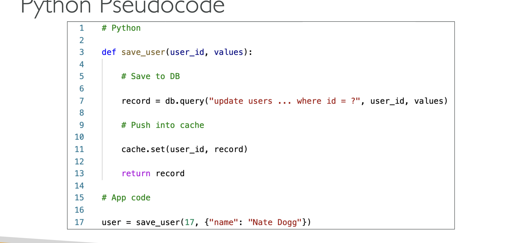

**AWS DVA - C02**

**AWS Cloud Overview**:

Factors affect choosing an AWS Region:
1. Compliance with data governance and legal requirements - data never leaves a region without permission.
2. Proximity to customers: reduces latency
3. Available services: not every new service  is available in every region	
4. Pricing: varies from region to region

AZs: each region has usually 3 AZs, 
- Each AZ is one or more data centers with redundant power, connectivity and network.
- Separate from each other, so isolated from disaster.
- They are connected with high bandwidth and ultra low latency.

Edge Locations: Points of Presence
- Content is delivered to end users using low latency.

> Choose the closest location to you in the course, using us-east-2: Ohio

---
***

# Section 4: IAM & AWS CLI

IAM  - Identity and Access Management, Global Service.

#### IAM Groups

Root account created by default, shouldn't be used or shared.
- Instead create users, users are people within your org, and can be grouped.
- Groups only contain user, cannot contain other groups.
    - Users don't have to belong to a group, and user can belong to multiple groups

Why do we create groups? coz we want to give permissions to the users in the group to use account/access somethings.

### IAM Permissions

- Users or Groups can be assigned JSON documents called **policies**.
- these policies define the permissions of the users.
> In AWS you apply the ***least privilege principle***: don't give more permissions than a user needs

Did Hands on User creations.

### IAM Policies Inheritance

Policy Structure:
- Consists of
    - version: policy lang version, always include "2012-10-17"
    - Id: an identifier of policy(Optional)
    - statement: one or more individual statements
- Statement consists of
    - sid: statement id
    - effect: allow/deny
    - principal: account/user/role to which this policy is applied to.
    - action: list of actions this policy allows or denies
    - resource: list of resources to which the actions applied to
    - condition: when this policy is in effect (Optional)

IAM Policies Hands On:

### IAM MFA Overview:

IAM Password Policy
- Strong password = high security.
In Aws we can set a password policy:
- set a min password length, require specific character types like numbers and special characters
- allow all IAM users to change their own passwords
- require users to change their password after some time(expiration like 90days) and preventing password re-use.

IAM MFA: 
- protect atleast root accounts and IAM users.
- MFA devices
    - virtual MFA: Google authenticator or authy.
    - Universal 2nd Factor (U2F) Security Key: YubiKeys
    - Hardware Key Fob MFA Device: like Gemalto
    - Hardware key Fob MFA Device for AWS Gov Cloud(US): provided by SurePassID

IAM MFA Hands On:

### IAM AWS Access Keys

to access AWS we have 3 options:

1. AWS Management Console - protected by password + MFA
1. AWS Command Line Interface (CLI) - protected by access keys
1. AWS Software Development Kit (SDK) - for code: protected by access key

- Access Keys are generated through AWS console
- Users manage their own access keys
- Access keys are secret, just like a password, do not share them.
- Access Key ID = username
- Secret Access Key = password

AWS CLI: a tool that enables you to interat with AWS Services using commands in your command-line shell.
- direct access to public apis of AWS Services.
- you can develop scrips to manage your resources. kinda alternate to using AWS Management Console.

AWS SDK:
- language specific API
- enables you to access and manage AWS Services programmatically.
- embedded within your application
- supports
    - sdks like java, python, js, go, node js etc
    - mobile sdks like adroid and java
    - iot device sdk like embedded c, Arduino

AWS CLI Hands on:

aws configure: command is used to configure

and to check/confirm configuration use aws configure list command

aws iam list-users command will give all users

AWS CloudShell: shell inside the Management Console 

### IAM Roles for AWS Services:
- some service will need to perform actions on your behalf.
- to do so, we will assign permissions to AWS Services with AWS IAM Roles.
- common roles like EC2 Instance Roles, Lambda Fuction Roles, Roles for CloudFormation.

IAM Roles hands on:

Created a IAM Role for EC2 and give permission as IAMReadOnlyPermission.

### IAM Security Tools

- IAM Credential Report (account level)
    - a report of list all your account's users and the status of their various credentials.

- IAM Access Advisor (user-level)
    - Access advisor shows the service prmissions granted to a user and when those services were last accessed/used.
    - we can use this info to revise the policies.

Security Tools hands on: 

credential report - is on the left hand side under access report, go there and download the report.

access advisor - go to the specific user and click on the access advisor, it will pop up all the permissions.

### IAM Guidelines and Best Practices

- Don't use the root account except for AWS account setup.
- One physical user = one AWS user.
- assign users to groups and assigne permissions to groups.
- create a strong password policy and use mfa
- create and use roles for giving permissions to AWS services
- use access keys for programmatic access (CLI/SDK)
- audit permissions of your account using IAM Credentials Report or IAM Access Advisor.
- Never share IAM users and Access Keys.

### IAM Shared Responsibility Model

AWS:

Infrastructure(global network security), configuration and vulnerability analysis, compliance validation.

User:

Users, groups, roles, policies management and monitoring.

enable mfa on all accounts, rotate all your keys often, use IAM tools to apply appropriate permissions.

analyze access patterns and review permissions

---
***

# Section 5: EC2 Fundamentals

### EC2 Basics

It is the most popular offering of AWS

EC2 = Elastic Compute Cloud = IaaS

mainly consists in the capability of:
- renting virtual machines (EC2)
- storing data on virtual drives (EBS)
- distributing load across machines (ELB)
- scaling the services using an auto scaling group (ASG)

**EC2 sizing and configuration options**:

- OS: Linux, windows or Mac OS
- How much compute power and cores (CPU)
- How much RAM
- how much storage space:
    - Network attached like EBS & EFS
    - hardware - EC2 instance store
- Network card: speed of the card, public IP address.
- firewall rules: security group
- bootstrap script - configure at first launch - EC2 user data.

**EC2 User Data**:

- it is possible to bootstrap our instance using an EC2 User data script.
- bootstrapping means launching commands when a machine starts.
- script is only run once at the instance first start
- Ec2 user data is used to automate boot tasks such as: installing updates, installing softwares, downloading common files from the internet...
- EC2 user data script runs with the root user.

EC2 instace types:

### Create a EC2 instance with EC2 User Data to have a website

follow the process to create an instance, start, stop and terminate

### EC2 Instance types overview

naming convention: m5.2xlarge

- m: instance class
- 5: generation (AWS Improves them over time)
- 2xlarge: size within the instance class

General Purpose: great for diversity of workloads such as web servers or code repositories.
- balance bw: compute, networking and memory.

Compute Optimized: great for compute-intensive tasks that require high performance processors/
- batch processing workloads, media transcoding, high performance web servers, ML, dedicated gaming servers.
- instance class starts with c

Memory Optimized: fast performance for workloads that process large data sets in memory

- use cases: high performance relational/non-relatinal dbs, in memory dbs optimized for BI
- name series start with R for ram, x1 and z1

Storage Optimized: great for storage intensive tasks that require high read and write access to large data sets on local storage.
- use cases: relational and nosql dbs, cache for in-memory dbs, high freq online transation processing (OLTP), 
- starts with i, d, or h1

### Intro to Security Groups

- fundamental of network security in AWS
- they control how the traffic is allowed in or out of our EC2 instances.
- SGs only contain allow rules
- SG rules can reference by IP or by securtiy group.
- SGs are like acting firewall for EC2 instances.
- they regulate: access to ports, authorized ip ranges - ipv4 and ipv6, control of inbound and outbound networks

Good to Know data:
- SGs can be attached to multiple instances.
- locked down to a region/VPC combination
- does live **outside** the EC2 - if traffic is blocked teh EC2 instance won't see it.
> its good to manintain one separate SG for SSH access.
- if your application is not accessible (time out), then it's asecurity group issue.
- if your application gives a "connection refused" error, then it's an application error or it's not launched
- By default all inbound traffic is blocked and all outboudn traffic is authorized

Classic ports ot know:
- 22: SSH - log into a linux instance
- 21: FTP - upload files into a file share
- 22: SFTP (Secure FTP) - upload files using ssh
- 80: HTTP - access unsecured websites
- 443: HTTPS - access secured websites
- 3389: RDP(Remote Desktop Protocol) - to login to a windows instance

Security Groups hands on:

- if there is a timeout, it's mostly coz of Instance SG.

### SSH Overview

Connect to SSH using Linux or Mac

During the creating/launching instance we have downloaded a key pair like EC2Tutorial.pem file.

go to the folder in the terminal where we have the EC2Tutorial.pem file, and type the command below:

ssh -i EC2Tutorial.pem ec2-user@18.116.81.233

here 18.116.81.233 is the public ip for the instance

May be you will get the errors as permissions required for the EC2Tutorial.pem file so use this command chmod 0400 EC2tutorial.pem to give permissions and then run the ssh command again then you will be able to connect.

#### Instance Connect

in the instance page there would be connect on the top click it and follow the process.

### EC2 Instance Roles 

Demo: while using the instance connect, we need to configure the credentials, we are not supposed to put credentials in there, so then we need the Roles.

To add IAM Role go to Action on top right corner in the instance page

Actions > Security > Modify IAM role

Now role is attached to the instance.

---
***

# Section 6: EC2 Instance Storage

### EBS Overview

Elastic Block Storage - EBS is a **network drive** you can attach to your instances while they run.
- It allows your instances to persist data, even after their temination.
- they can be only mounted to one instace at a time(at CCP Level) but can have multi-attach (at Dev, Sysops, Sol Architect level)
- EBS are bound to specific AZ.
- think of them as a network USB stick

EBS Volume: 
- It is a network drive (not a physical drive)  
    - It uses the network to communicate the instance, which means there might be a bit of latency.
    - It can be detached from an instance and attached to another one quickly.
- It's locked to an AZ.
    - an EBS Volume in us-east-1a cannot be attached to us-east-1b
    - to move a volume across, you first need to snapshot it.
- Have a provisioned capacity (size in GBs, and IOPS input/output operations per sec)
    - you get billed for the provisioned capacity and you can increase the capacity of the drive over time.

EBS - Delete on termination attribute (last to 2nd column)
- controls the EBS behaviour when an EC2 instance terminates
    - by default, the root EBS volume is deleted (attribute enabled - check box ticked)
    - by default, any other attached EBS volume is not deleted (attribute disabled - check box unchecked)
- this can be controlled by AWS console/ AWS CLI
- use case: preserve root volume when instance is terminated.

EBS Hands on 

On the instance page, go to storage and under the volume you can see the EBS attached to it, you can create a new one and attach via actions > attach volume, and check on instance page > storage > volume

Note: you can only attach to the same AZ of the instance, means instance and the Volume that you are gonna create should be in same volume

Deleting is click on the any volume, go to actions > delete volume

Delete on termination: on the storage on instance page, scroll to the end (last to 2nd option) delete on the termination, is yes for the default volume and others are no, i.e., if you terminate (Actions > Terminate instance ) the instance the volume that is attached by default is also terminated by the ones that we attached will not be terminated

### EBS Snapshots

- make a backup (snapshot) of EBS volume at a point of time.
- not necessary to detach the volume to take snapshot, but recommended
- Can copy snapshots across regions and AZs

EBS Snapshot features:

- EBS Snapshot Archive: move snapshot to archive tier - 75% cheaper - restoring take 24 to 72hrs
- Recycle bin for snapshots: set up rule to recover snapshot - specify retention from 1 day to 1 year
- Fast Snapshot Restore (FSR): force full initialization of snapshot no latency on first use- costly

EBS Snapshot hands on:

click on the volume > Actions > Create snapshot

Left side under the EBS > click on snapshots, you can see all the snapshots, right click on the snapshot then copy, now you can transfer this to any destination AZ

Actions > create volume from snapshots - we can create the volume based on snapshot in any AZ

on the top there would be Recycle bin click that and can set a rule for retention rule for EBS snapshot - we can recover it.

### AMI Overview
Amazon Machine Image

AMI are customization of EC2 instances.
- can add own software, os, configuration, moitoring ..
- faster boot/ configuration time coz all software is pre-packaged

AMIs are built for specific region and can be copied across regions.

You can launch EC2 instance from 
- pulic AMI: AWS provided
- your own: make and maintain by you
- AWS marketplace: some one else made and sells

AMI Process for EC2 instance:

- start an EC2 instance and customize it.
- stop the instance (data integrity)
- build an AMI - this will create an EBS snapshot
- Launch instance from other AMI (can launch in diff AZ)

AMI Hands on:

Create an instance > right click on the instance > image and templates > create image 

Left side unde Images > AMI - select the image that we created and top right there would be Launch Instance from AMI

or while creating the instance in the instance page instead of selecting quick start, just left to that My AMI click that and select the AMI

### EC2 instance store

EBS voluems are network drives with good but "limited" performance
- if you need a higher performance hardware disk, use EC2 Instance store.

- better I/O performance
- EC2 instance stores lose their store if they're stopped (ephemeral)
- Good for buffer/cache/temp data
- risk of data loss if hardware fails
- backups and replication are you responsibility

### EBS volume types

6types

- gp2/gp3 (SSD) - general purpose - balance price and performance
- io1/io2 block express (SSD) - Provisioned IOPS - high performance SSD volume for machine critical low latency or high-throughput workloads - supports EBS Multi-attach
- st1 (HDD) - low cost HDD volume designed for frequently access, through put intensive workloads 
- sc1 (HDD) - lowest cost HDD for less freq accessed workloads

EBS volumes are characterized in size/throughput/IOPS

- only SSD based volumes can be used as a boot volume

### EBS Multi-attach

- io1/io2 family

- Attach the same EBS volume to multiple EC2 instances in same AZ
- each instance has full read & write permissions to high performance volume
- upto 16 ec2 instances at a time
- must use a file system that is cluster aware (not XFS, EXT4 ...)

use cases: 
- higher application availability 
- applications must manage concurrent write operations

### EFS Overview
Elastic file system
- managed NFS (Network File System) that can be mounted on many EC2 instances.
- EFS works with EC2 instance in multiple AZs
- highly available, scalable, expensive

Ex: from 3 AZs us-east-1a, us-east-1b, us-east-1c EC2 instances can connect to EFS surrounded by security group at the same time

use cases: content management, web serving, data sharing, wordpress

- uses security group to control access to EFS
- compatible with linux based AMI(not windows)
- encryption at rest using KMS
- POSIX file system (~Linux) has a standard file API
- File System scales automatically, pay-per-use, no capacity planning

Performance:
- gp (default) - latency sensitive use cases
- max i/o - high latency, throughput, highly parallel

Storage Tier:
- standard, inferquent access (EFS_IA), archive

EFS hands on:
create a EFS

then while creating the instance use the newly created EFS before adding FS you need to create/add subnet

connect to multiple instances, create a file from one instance and then check this file in another instance, you can see the file

### EFS vs EBS

EBS volumes:
- one instance (expect multi-attach io1/io2)
- are locked at AZ level
- gp 2 - io increases if disk size increase
- gp3/io1 - can increase io independantly

To migrage an ebs across AZ
- take a snapshot, restore the snapshot using another AZ
- EBS backup use IO, you shouldn't use this while application is handling a lot of traffic

Root EBS voluems gets aterminated if ec2 instance is terminated 

EFS:
- mouting 100s of instances acroos AZ
- EFS share webiste file(wordpress)
- only for linux (POSIX)

- EFS has high price point than EBS
- can leverage storage tier for cost savings

### EBS & EFS cleanup

for file system, goto actinos and delete

terminate instances
 
volumes - right click and delete

snapshots - right click and delete

SGs- right click and delete

---
***

# Section 7: AWS Fundamentals: ELB + ASG

### High availability and scalability

scalability means an application/system can handle greater loads by adapting.

scalability is linked but different to high availability.

vertical scalability {scale up/down}- increase the size of instance
- common for non distributed sustesm like databases, RDS, ElastiCache

there would be hardware limit

Horizontal scalability {scale out/in} (=elasticity)- increaing the no of instances. - implies distributed systesm.

- common for web apps/ modern apps
- easy to horizontally scal thanks to cloud offerings

- ASG, Load Balancer

High availability - usually goes hand in hand with horizontal scaling
- means running application/system in atleast 2 data centers (same as AZs)
- goal of high availability is to survive a data center loss

- ASG multi AZ, LB multi AZ

### ELB Overview

what is load balancing? - Load balances are servers that forward traffic to multiple servers (eg EC2 instances) downstream

Why load balancers?
- spread load across multiple downstream instances
- expose a single point of access (DNS) to your application
- seamlessly handle failures of downstream instances
- do regular health checks to your instances
- provide SSL termination (HTTPS) for your websites
- high availability across zones
- seperate public traffic from private traffic

Why ELB?
- it is a managed load balancer
    - AWS gaurantes that it will be working, AWS takes care of upgrades, maintenance, high availability

- it costs less to set up your own lb but it will be a lot more efforts on your end.

- it is integrated with many AWS offerings/services
    - ec2, ec2 ASG, Amazon ECS(elastic container service)
    - AWS certificate manger (ACM), cloudwatch
    - route 53, AWS WAF, AWS Global Accelerator

health checks:
- crusial for LBs, they enable the LB to know if instances it forwards traffic to are available to reply to requests.
- health check is done on a port and route (/health is common)
    - eg: protocol: HTTP, Port: 4567, Endpoint: /health
- if the response is not 200 OK, then the instane is unhealthy

types of LB on AWS

4 kinds:
1. classic LB - CLB 
    - depricated but still available to use
    - HTTP, HTTPS, TCP, SSL (Secure TCP)

2. application LB - ALB
    - HTTP, HTTPS, WebSocket

3. Netowrk LB - NLT
    - TCP, TLS (secure TCP), UDP

4. Gateway LB - GWLB
    - operates at layer 3(Network layer) - ip protocol

it is recommended to use the newer generation Lbs as they provide more features

some lb can setup internal (public) or external (private) ELBs

Load Balncer Security groups

users can connect to LB using HTTP(port 80) or HTTPS(port 443)

and then the Ec2 instances should allow traffic only directly from LB

### Classic LB

Note: CLB is deprecated at AWS and will soon will not be available in AWS console. exam has also removed any references to it.

### Application LB (v2)

ALB is a layer 7 (application - HTTP)

load balancing to multiple HTTP applications across machines(target groups)

load balancing to multiple applications on the same machine (ex: containers)

support for HTTP/2 and websocket

support redirects (from HTTP to HTTPS for example)

routing tables to different target groups:
- routing based on path in URL (example.com/users)
- based on hostname in URL (one.example.com, other.example.com)
- vased on Query String, Headers (examples.com/users?id=123&order=false)

ALB are great fit for micro services & container based application (ex: docker & amazon ECS)
- has a port mapping feature to redirect to a dynamic port in ECS
- in comparison, we'd need multiple CLB per application

here external ALB is public faced

ALB Target Groups:
- EC2 instances (can be managed by an ASG) - HTTP
- ECS tasks (managed by ECS itself) - HTTP
- Lambda functions - HTTP request is translated into a JSON event
- IP addresses - must be private IPs
- ALB can route to multiple target groups
- health checks are at the target group level

ALB query strings/parameter routing:

Good to Know data:
- fixed hostnames (xxx.region.elb.amazonaws.com)
- the application servers (eg: ec2 instances) don't see the IP of the client directly
    - the true IP of the client is inserted in the header X-forwared-for
    - we can also get Port (X-Forwarded-Port) and protocol (X-Forwarded-protocol)

ALB Hands On: part 1 -  video 61

create an first instance without the key pair and use the SG launch-wizard-1(allows SSH traffic and HTTP traffic) and use ec2 data to show Hello world.

create a second instance similarly

Goto Load Balancing (on left side) > load balancers > create lb

Create a new SG to allow only HTTP from anywhere, follow steps and click next and register instances, it is linked under the listener

ALB hands on: part 2 - video 62

previously we allowed traffic to instances from anywhere, now we need to change the SG inbound rules as it should only allow traffic from only LB - so goto SG > open SG > edit inbound rules and search for the "load" there you will get the SG group of load balancer
- here tightened the network security

goto LB > select LB > listener > add rule > name: demorule > add condition > eg: path /error (multiple possibilities) > action types > set priorities 1 is highest 50K is lowest

### Network LB (v2)
layer 4(Network layer) LB
- forward TCP & UDP traffic to your instances
- handle milions of requests per seconds
- less latency ~ 100ms (vs 400ms for ALB)

NLB has **one static IP per AZ**, and supports assignign Elastic IP (helpful for whitelisting specific IP)

NLB are used for extreme performance, TCP or UDP traffic.
- not in the free tier

TCP (Layer 4) based traffic

NLB Target Groups
- ec2 instances
- IP addresses - must be private IPs (like our own data center)
- ALB 
- health checks support TCP, HTTP, HTTPS protocols

NLB hands on:

create NLB > choose internet facing and ipv4 > choose all AZs > attach SGs -> create new oneallow http traffic from anywhere and remove the default one > in listener use TCP port 80 and create a target gropu choose instances protoco is TCP over port 80 and health check is HTTP

Make 2 available instances and add those in the NLB

delete all as part of clean up

### Gateway LB (GWLB)

- deploy, scale and manage a fleet of 3rd party network virtual appliances in AWS
- ex: Firewalls, IDS and IPS, Deep Packet Inspection Systems, payload manipulation,...

explanation: the users send traffic and based on the routing table the traffic goes to GWLB and it routes to 3rd party apps like firewall one the checks are done(everything is okay) it returns to GWLB this then distributes the traffic to the applications like insatnces

- operates at layer 3 (network layer) - IP packets
- combines the following functions:
    - Transparent Network Gateway: single entry/exit for all traffic
    - Load Balancer - distributes traffic to your virtual appliances
- uses GENEVE protocol on port 6081

GWLB target groups:
- EC2 instances
- IP address - must be private IPs

### ELB - Sticky Sessions (Session Affinity)

- It is possible to implement stickiness so that the same client is always redirected to the same instance behind a load balancer

explanation: if the client1 sends the req and it is taken care by 1st ec2 instance then the subsequent requests will be sent to the same instance.

- this works for CLB, ALB, NLB
- cookie is used for stickiness and it has an expiration date that you control. Note: NLB works without cookies
- use case: to make sure the user doesn't lose his session data
- enabling stickiness may bring imbalance to the load over the backend EC2 instances

Cookie Names
- Application based cookies
    - custom cookies
        - generated by target
        - can include any custom attributes reqruired by the application
        - cookie names must be specified individually for each target group
        - don't use AWSALB, AWSALBAPP or AWSALBBTG (reserved for theuse of ELB)
    - appplication cookies
        - generated by the lb
        - cookies name is AWSALBAPP
- duration based cookies
    - cookies generated by the lb
    - cookies nameis AWSALB for ALB, AWSELB for CLB

hands on:

open instance > target groups > actions > edit attributes > there would be a check box for stickiness, we can see 2 types: 
1. lb generated cookies 
2. applicaction based cookies

### ELB - Cross Zone Load Balancing

explanation: with cross zone - total requests will be 100 and distribted across the AZs 

ALB
- Cross ZoneLB is enabled by default (can be disabled at the Target Group Level)
- no charges for inter AZ data

NLB & GWLB
- CZLB is disabled by default
- you pay charges for inter AZ data if enabled

CLB
- CZLB id disabled by default
- no charge for inter AZ data if enabled

hands on:
for NLB, select NLB > attributes > cross zone load balancing is off by default > edit and turn on

Similarly for GWLB

for ALB, select LB > attributes > cross zone load balancing is on by default
goto trget group and attributes and edit select off from the drop down

### ELB SSL certificates

SSL/TLS basics

- An SSL certificate allows traffic b/w your clients and your LB to be encrypted in transit (in- flight encryption)

- SSL (secure socket layer) used to encrypt connections
- TLS (transport layer security) is a newer version of SSL
- Nowadays, TLS certificates are mainly used bt people still refer as SSL

- public SSL certificates are issued by Certificate Authorities (CA) like comodo, symantec, godaddy, digicert etc

- SSL certificates have an expiration date (you set) adn myst be renewed

- The load balancer uses an X.509 certificate (SSL/TLS server certificate) 
- You can manage certificates using ACM (AWS Certificate Manager)
- You can create upload your own certificates alternatively
- HTTPS listener:
    - You must specify a default certificate
    - You can add an optional list of certs to support multiple domains
    - Clients can use **SNI** (Server Name Indication) to specify the hostname they reach
    - Ability to specify a security policy to support older versions of SSL /TLS (legacy clients)

Server Name Indication (SNI): solves the problem of loading multiple SSL certificates onto one web server (to server multiple websites)
- Its a newer protocol, and requires the client to indicate the hostname of the target server in the initial SSL handshake
- the server will find the correct certificate or return the default one

Note: only works for ALB & NLB (newer gen), CloudFront
- do not work for CLB (coz its older gen)

Classic Load Balancer (v1)
- Support only one SSL certificate
- Must use multiple CLB for multiple hostname with multiple SSL certificates

Application Load Balancer (v2) & Network Load Balancer (v2)
- Supports multiple listeners with multiple SSL certificates 
- Uses Server Name Indication (SNI) to make it work

ELB SSL certificates hands on:

open LB like ALB > goto listeners and add a listener > add protocoll like HTTP > and change the default action to forward it to target group > Secure listener settings is the one about SSL certificates, add security policy

same process for NLB

### ELB - Connection Draining

Feature naming
- Connection Draining – for CLB
- Deregistration Delay – for ALB & NLB

- Time to complete “in-flight requests” while the instance is de-registering or unhealthy
- Stops sending new requests to the EC2 instance which is de-registering
- can set the time Between 1 to 3600 seconds (default: 300 seconds)
- Can be disabled (set value to 0)
- Set to a low value if your requests are short
- set to a high value if requests are long like uploading

### Auto Scaling Group (ASG) Overview

- in real life, the load on your websites and application can change
- in cloud, you can create and get rid of servers veru quickly

the goal of ASG is to 
- scale out(add instances) to match an increased load
- scale in (remove instances) to match a decreased load
- ensured we have a min and max no of instances running
- automaticaly register new instance to a LB
- re-create an instance in case a previous one is terminated (ex: if unhealthy)

ASG are free (you only pay for underlying EC2 instances)

ASG attributes:
- a launch template (older "launch configurations are deprecated)
    - AMI + instance types, ec2 user data, ebs volume, SG, SSH key pair, IAM roles for your ec2 instance, network + subnet information, LB information
- min size/ max size/ initial capacity
- scaling policies

AS - CloudWatch ALarms & scaling:

- it is possible to scale an ASG based on cloudwatch alarms
- an alarm monitors a metric (such as avg cpu or a custom metric)
- metrics such as average CPU are computed for the overall ASG instances
- based on the alarm: we can create scale out (increase instances) or create scale in policies (decrease instances)

ASG hands on:

create a launch template and use this launch template while creating an ASG

### ASG - scaling policies

- Dynamic Scaling 
    - Target Tracking Scaling
        - simple to set-up
        - ex: i want the average ASG CPU to stay under 40%

    - Simple/ Step Scaling
        - when a cloud watch alarm is triggered (ex cpu > 70%), then add 2 units
        - when a cloud watch alarm is triggered (ex cpu < 30%), then remove 1 unit

- Scheduled Scaling:
    - anticipate a scaling basedon known usage patterns
    - ex: increase the mic capatity to 10 at 5pm on fridays

- predictive scaling: continulously forecast load and schedule scaling ahead
    - analyze historical load > generate forecast > schedule scaling actions

Good metrics to scale on:
- CPU utilization: average CPU utilization across your instances
- RequestCountPerTarget: to make sure the no of requests per Ec2 instace is stable
- average network in/out (if you're application is network bound)
- any custom metric (that you push using cloud watch)

ASG - scaling cooldowns:
- after a scaling activity happens, you are in the cooldown period(default: 300secs)
- during the cooldown period, the ASG will not launch or terminate additional instances(to allow for metrics to stabilize)

- Advice: use a ready to use AMI to reduce configuration time in order to be serving request faster and reduce the cooldown period

ASG Scaling policies hands on:

in ASG got to automatic scaling > create a scheduled action
- scheduled scaling

now predictive scaling - scale based on forecast

dynamic scaling policy 

1. simple scaling based on alarm
2. step scaling if alram hit add 10 units or so
3. atrget tracking policy

### ASG - Instance Refresh

goal: update launch template and then re-creating all EC2 instances

- for this we can use the native feature of instance refresh
- setting of minimum healthy percentage
- specify warm-up time(how long until the instance is ready to use)

ex: min health percentage is 60% so we have all the old template instances, and when we started startInstanceRefresh, it will create a instance with new template and one it takes traffic then it will stop the old instance and the process continues till all old template insatnces are stopped

---
***

# Section 8: AWS Fundamentals: RDS + Aurora + ElastiCache

### Amazon RDS Overview

Relational Database Service, RDS is a managed DB for DB use SQL as query language, 

It allows you to create dbs in cloud managed by AWS
- Postgres, MySQL, MariaDB, Oracle, Microsoft SQL server, IBM DB2, Aurora (AWS proprietary database)

Advantage over using RDS vs deploying DB on EC2.
RDS is a managed service
- automated provisioning, OS patching
- continuous backups and restore to specific timestamp (point in time restore)
- monitoring dashboards
- read replicas for improved read performance
- Multi AZ setup for DR (Disaster Recovery)
- maintenance windows for upgrades
- scaling capability (verical and horizontal)
- storage backed by EBS (gp2 or io1)

But you cant SSH into your instances

RDS - storage Auto scaling:
- helps you increase storage on RDS DB instance dynamically
- When RDS detects you are running out of free database storage, it scales automatically, avoid manually scaling your database storage
- you have to set Maximum Storage Threshold (maximum limit for DB storage)
- automatically modify storage if:
    - free storage is less than 10% of allocated storage
    - low storage lasts at least 5 mins
    - 6 hours have passed since last modification
- useful for appplications with unpredictable workloads
- supports all RDS database engines

### RDS Read Replicas vs Multi AZ

RDS Read Replicas for read scalability:

- upto 15 read replicas
- within AZ, cross AZ or cross Region
- replication is ASYNC, so reads are eventually consistent
- replicas can be promoted to their own DB
- application must update the connection string to leverage read replicas

RDS Read replicas - Use cases:
- you have a production database that is taking on normal load.
- you want to run a reporting application to run some analytics, if we run directly on the production db, this is gonna overload and we don't want to do that, instead we create a Read Replica to run the new workload there
- here the production application is unaffected
- read replicas are used for SELECT (=read) only kind of statements (not insert, update, delete)

RDS Read Replicas - Network Cost:
In AWS there's a network cost when data goes from one AZ to another.
- for RDS read replicas within the same region, you don't pay that fee.

Same Region read replica = free

cross region = need to pay the fee

RDS Multi AZ (Disaster Recovery):
- SYNC replication
- one DNS name - automatic app failover standby
- Increases availability
- Failover in case of loss of AZ, loss of network, instance or storage failure
- No manual intervention in apps
- not used for scaling*

exp: here if anything happens to master db then the standby database will take over

Note: The read replicas can be setup as Multi AZ for Disaster Recovery (DR)

RDS - from single AZ to multi AZ
- zero downtime operation (no need to stop the DB)
- just click on "modify" for the database 
- the following happens internally:
    - a snapshot is taken
    - a new DB is restored from the snapshot in a new AZ
    - synchronization is established b/w the two dbs

Amazon RDS hands on: video 78

RDS > create database > standard create > MySQL  > templates - prod > availability and durability - single/multi az db > create master username and password, follow the process along

download the sqlelectron to connect to the RDS.

to create read replica, go to actions > create read replica

to delete database > goto modify db instance and scroll down to the end > uncheck the enable deletion protection > continue > apply immediately - then you can delete database

### Amazon Aurora

- proprietary software from AWS(not open sourced)
- Postgres and mysql are both supported as Aurora DB (that means your drivers will work as if aurora was a postgres or mysql databases)
- aurora is "AWS vloud optimized: and claims 5x performance improvement ove mysql on RDS, over 3x the performance of postgres on RDS
- aurora storage automatically grows in increments of 10GB, up to 128TB
- aurora can have up to 15 replicas and the replication process is faster than MySQL
- failover in aurora is instantaneous. Its high available in nature
- aurora const more than RDS(20% more) - but is more effiecient

Aurora High Availability and Read Scaling:
- 6 copies over 3 Azs - means 2 copies on single AZ (highly available)
    - 4 copoies out of 6 needed for writes
    - 3 copies out of 6 need for read
    - self healing with peer-to-peer replication
    - storage is striped across 100s of volumes
- one aurora instance takes writes(master)
- automated failover for master in less than 30 secs
- master + up to 15 aurora read replicas serve reads
- support for Cross Region Replication
> in short, one master and other are replicas, and these replicas take over master incase of failover and storage is gonna be replicated + self healing + auto expanding

Aurora DB Cluster:

exp: master is the only thing that writes, there would be Writer Endpoint always pointing to the master, even if the master is in failover, clients talk to writer endpoint and it redirects to the right instance. read replicas has autoscaling.now we have autoscaling it will be hard to keep track of the read replicas and their URL and stuff, here comes the Reader Endpoint, it automoatically connects to all read replicas and load balancing dones here onces clients connects to the reader endpoint.
- Load balancing happens at connection level not at the statement level

features aurora:
- automatic failover, backup and recovery, isolation and security, indstry compliance, push button scaling, automated patching with zero downtime, advanced monitoring, routine maintenance, backtrack: restore data at any point of time without using backups.

Aurora hands on:

RDS  > create database > standard create > aurora mysql > choose version  > choose prod template > create passwords > cluster storage config - chooose standard > burstable classes > availability and durability > create an aurora replica or reader node in diff az > choose vpc > database port 3306 (mysql port by default)

once everything is created, there would be onw writer instance and one reader instance, you can add reader by clicking actions > add reader

or add replica auto scaling (undre actions too)

for deleting first delete reader instance than delete writer instance, then you can delete the cluster

### RDS & Aurora Security

- At-rest encryption:
    - db master & replicas encryption using AWS KMS - must be defined as launch time
    - if master is not encrypted , the read replicas cannot be encrypted
    - to encrypt an un-encrypted database, go through a db snapshot & restore as encrypted

- In-flight encryption: TLS -ready by default, use the AWS TLS root certificates client-side
- IAM Authentication: IAM roles to connect to your database (instead of username/pw)
- Security Groups: control network access to your RDS/Aurora DB
- no SSH available except on RDS custom
- audit logs can be enabled and sent to cloudwatch Logs for longer retention

### Amazon RDS Proxy

- fully managed db proxy for RDS.
- allows apps to pool and share db connections established with the database
- improving db efficiency by reducing the stress on db resources (eg. CPU, RAM) and minimize open connections (and timeouts)
- serverless, autoscaling, highly available(mulit az)
- reduced RDS & aurora failover time by up 66%
- no code changes required for most apps, (insted connecting to RDS db instance you will connect to RDS proxy)
- enforce IAM authentication for DB, and securely store credentials in AWS secrets manager
- RDS proxy is never public accessible (must be accessed from VPC)

### ElastiCache Overview

RDS is to manage Relational databased, ElastiCache is to manage Redis or Memchached
- caches are in-memeory databases with really high performance, low latency
- helps reduce load off of databases for read intensive workloads
- helps makeyour application stateless
- aws wil take case of OS maintenance/ patching, optimizations, setup, config, monitoring, failure recovery adn backups

- using ElastiCache involves heavy application code changes 

ElastiCache Solution Architecture - DB Cache:
- applications queries ElastiCache, if nto available get from RDS and store in ElastCache
- helps relieve load in RDS
- cache must have an invalidation strategy to make sure only the most current datais used in there

Elasticache Solution Architecture - user session store:
- user logs into any of the application
-the application writes the session data into Elasticache
- the user hits another instance of our application then the instance retrieves the data and the user is already logged in

Elasticache - Redis vs Memcached:

Elasticache hands on:

elasticache > redis caches > create redis cache > design your own cache > easy create > config: demo > auto failover enable - follow process along

### Elasticache Strategies

- Is it safe to cache data? Data may be out of date, eventually consistent
- Is caching effective for that data?
    - Pattern: data changing slowly, few keys are frequently needed
    - Anti patterns: data changing rapidly, all large key space frequently needed
- Is data structured well for caching?
    - example: key value caching, or caching of aggregations results

Which caching design pattern is the most appropriate?

Lazy Loading/ Cache-Aside/ Lazy Population:

python pseudocoe:

Write Through - add o rupdate cache when database is updated

paseudocode:

Cache Evitions and Time to Live (TTL):

- Cache eviction can occur in three ways:
    - you can delete an item explicitly in the cache
    - item is evicted because the memory is full and it's not recently used (LRU - least recently used)
    - you set an item TTL

- TTL are helpful for any kind of data: like leaderboards, comments , activity streams

- TTL can range from few secs to hours or days:

- if too many evictions happens due to memory, you should scale up(vertical) or out(horizontal)

Final words of wisdom
- Lazy Loading / Cache aside is easy to implement and works for many situations as a foundation, especially on the read side (read performance)
- Write-through is usually combined with Lazy Loading as targeted for the queries or workloads that benefit from this optimization
- Setting a TTL is usually not a bad idea, except when you’re using Write- through. Set it to a sensible value for your application
- Only cache the data that makes sense (user profiles, blogs, etc...)
- Quote:There are only two hard things in Computer Science: cache
invalidation and naming things

### Amazon Memory DB for Redis - Overview

- Redis-compatible, durable, in-memory database service
- Ultra-fast performance with over 160 millions requests/second
- Durable in-memory data storage with Multi-AZ transactional log
- Scale seamlessly from 10s GBs to 100s TBs of storage
- Use cases: web and mobile apps, online gaming, media streaming, ...

# Section 9: Route 53

### What is a DNS?

domain name syste - DNS translates the human friendly hostnames into the machine IP addresses
- ex: www.google.com => 172.17.18.36
- DNS is the backbone of the internet
- DNS uses hierarchial naming structure like .com, example.com, www.example.com, api.example.com

DNS Terminologies:

- Registrars: route 53, godaddy, ..
- DNS records: A, AAAA, CNAME, NS, 
- Zone File: contains DNS records
- Name Server: resolves DNS queries (Authoritative or Non- Authoritative)
- Top Level Domain(TLD): .com, .us, .in, .gov, .org
- Second Level Domain (SLD): amazon.com, google.com, 

How DNS works?

exp: first browser asks local DNS if it doesn't has it will ask the root DNS server, may be it might not know the example.com, but it does know the .com so it will send the .com server 1.2.3.4, then local DNS server will ask the TLD .com server, it will give the ip as 5.6.7.8, then local DNS will ask the SLD DNS server, it will give the correct ip of the hostname it will then give it to the browser, then the browser will route the request to the example.com web server.

### Route 53 Overview

- a highly available, scalable, fully managed and Authoritative DNS
    - Authoritative = the customer can update the DNS records
- route 53 is also a domain registrar
- ability to check the health of your resources
- the onlyl AWS service which provided 100% availability SLA
- why route 53? 53 is the reference to the traditional DNS port

Route 53 - records:
- how you want to route traffic for a domain
- each record contains:
    - domain/subdomain name: eg: example.com
    - record type. eg: A or AAAA
    - value- eg: 12.34.56.78
    - routing policy - how route 53 responds to queries
    - TTL - amount of time the record cached at DNS resolvers
- route 53 supports the following DNS record types:
    - (must know) - A/ AAAA/ CNAME/ NS
    - (advanced) - CAA/ DS/ MX/ NAPTR/ PTR/ SOA/ TXT/ SPF/ SRV

ROute 53 - record types

- A - maps a hostname to IPv4
- AAAA - maps a hostname to IPv6
- CNAME - maps a hostname to another hostname
    - target is a domain name which must have an A or AAAA record
    - can't create a CNAME record for the top node of a DNS namespace (Zone Apex)
    - ex: you can't create for example.com, but you can create for www.example.com
- NS - name servers for the hosted zone
    - control how traffic is routed for a domain

Hosted Zones:
- a container for records that define how to route traffic to a domain and its subdomains

- Public Hosted Zones - contains records that specify how to route traffic on the internet ( public domain names)
    - application1.mypublicdomain.com
- Private Hosted Zones - contain records that specify how you route traffic within one or more VPCs (private domain name)
    - application1.company.internal
- you pay $0.5 per hosted zone

### Route 53 - registering a domain

click on registered domainsunder the domains in the route 53, click on register domain, enter the domain name 

### Route 53 - creating our first records

got the created domain and click on create record

check using nslookup or dig command

### Route 53 - EC2 - Setup

create an ec2 instance without creating key pair - create 3 instances in 3 regions and create an ALB (SG - ssh and http enabled)

### Route 53 - TTL

High TTL – e.g., 24 hr
- Less traffic on Route 53
- Possibly outdated records

Low TTL – e.g., 60 sec.
- More traffic on Route 53 ($$)
- Records are outdated for less time
- Easy to change records

Except for Alias records, TTL is mandatory for each DNS record

now hands on: create a record for the domain we created  and the value is the one of the 3 ec2 instances public ip

when we entered the url then it will route us to this ec2 instance

### CNAME vs Alias

- AWS Resources (Load Balancer, CloudFront...) expose an AWS hostname:
    -lb1-1234.us-east-2.elb.amazonaws.com and you want myapp.mydomain.com

- CNAME:
    - Points a hostname to any other hostname. (app.mydomain.com => blabla.anything.com) 
    - ONLY FOR NON ROOT DOMAIN (aka. something.mydomain.com)

- Alias:
    - Points a hostname to an AWS Resource (app.mydomain.com => blabla.amazonaws.com)
    - Works for ROOT DOMAIN and NON ROOT DOMAIN (aka mydomain.com)
    - Free of charge
    - Native health check

Alias Records
- Maps a hostname to an AWS resource
- An extension to DNS functionality
- Automatically recognizes changes in the resource’s IP addresses
- Unlike CNAME, it can be used for the top node of a DNS namespace (Zone Apex), e.g.: example.com
Amazon Route 53
- Alias Record is always of type A/AAAA for AWS resources (IPv4 / IPv6)
- You can’t set the TTL

Alias Records Targets:
Elastic Load Balancers, CloudFront Distributions, API Gateway, Elastic Beanstalk environments, S3 Websites, VPC Interface Endpoints, Global Accelerator accelerator, Route 53 record in the same hosted zone

- You cannot set an ALIAS record for an EC2 DNS name

hands on =>

creating a CNAME while creating the record 

and while creating an alias just check the toggle button for alias 

### Routing policy - Simple

- Define how Route 53 responds to DNS queries
- Don’t get confused by the word “Routing”
    -   It’s not the same as Load balancer routing which routes the traffic
    - DNS does not route any traffic, it only responds to the DNS queries

Route 53 Supports the following Routing Policies
• Simple
• Weighted
• Failover
• Latency based
• Geolocation
• Multi-Value Answer
• Geoproximity (using Route 53 Traffic Flow feature)

Simple:
- route traffic to a single resource
- can specify multiple values in the same record
- if multiple values are retured, a random one is chosen by the client from those multiple retured values
- when Alias enabled, specify only one AWS resource 
- can't be associated with health checks

hands on: while creating the record, there would be routing policy drop down box choose simple

to check the ip we need to use the dig command, but in cloudshell dig wouldn't be there so to install it use this command "sudo yum install bind-utils"

### Routing POlicy - Weighted

- control the % of the requests that go to each specific reasource
- assign each record a relative weight:
    traffic (%) = weight for a specific record / sum of all the weights for all records

- dns records must have the same name and type 
- can be associated with health checks
- use cases: load balancing bw regions, testing new application versions...

- assign a weigh of 0 to a record to stop sending traffic to a resource
- if all records have weight of 0, then all records will be returned equally.

hands on: use weighted while creating, and afte it's done, click on add another record and use the same name to create the record, but change the weight value

to check use dig command

### Routing Policy - Latency - based

- redirect to the resource that has the least latency close to us.
- super helpful when latency for users is a priority
- Latency is based on the traffic bw users and AWS regions.
    ex: Germany users may be directd to the US (if that's the lowest latency)
- can be associated with health checks ( has a failover capability)

hands on: use latency as a routing policy dropdown box, created in 3 different regions, when we use the dig command we will get only one as it is the nearest one

if we want to check for another resource then use the vpn nearer to the location/region that we created

### Route 53 - Health Checks

- HTTP Health Checks are only for public resources
- Health Checks => automated DNS failover:
    
    1. health checks that monitor an endpoint (application, server, other applications)
    2. Helath checks that monitor other health checks (caluclated health checks)
    3. health checks that monitor CloudWathc alarms (full control) - eg throttles of dynamodb, alarms on RDS, custom metrics... (helpful for private resources)

- health checks are integrated with cloudwatch metrics.

1. Health Checks - monitor an end point: 
- about 15 global health checkers will check the endpoint health
    - healthy/unhealthy threshold - 3 default
    - interval - 30 sec ( can set to 10 sec - higher cost)
    - supported protocol: HTTP, HTTPS, TCP 
    - if > 18% of helath checkers report the endpoint is helathy, route 53 considers it healthy, otherwise its unhealthy
    - ability to choose which locations you want route 53 to use
- helath checks pass only when the endpoint responsds with 2xx and 3xx status codes
-health checks can be setup to pass/fail based on the text in the first 5|20 bytes of the response.
- configure you router/firewall to allow incomin request from route 53 health checkers.

2. caluclated health checks: 
- conbine the results of multiple health checks in to a single health check 
- you can use OR, AND or NOT
- can monitor up to 256 child health checks
- specify how many of the health checks need to pass to make the parent pass
- usage: perform maintenance to your website without causing all health checks to fail

3. private hosted zones:
- route 53 health checkers are outside the VPC
- they can't access private endpoints (private VPC or on-premises resource)

- you can create a CloudWatch Metrci and associate a CloudWatch Alarm, then create a health check that checks the alarm itself

Route 53 - health checks hands on:

route 53 > dashboard > create health check 

1. create end point health check for the 3 ip's 

and to check unhealth , change the inboud rule to not allow http requests then after some time it wil be unhealthy

2. create an calucated health check on te previous created health check

3. for private hosted zones we are supposed to reate a cloudwatch alarm and then health check on that alarm

### Routing policies - Failover (active - passive)

hands on fail over:
need to create a new record , select failover under the routing policy 
create another record as like a back up, once the first one is unhealthy it will route to the back up one 

### Routing Policy - Geolocation

- different from Latency-based
- this is based on user location
- specify location by continent, countr or by US state (if ttheres overlapping most precise location selected)
- should create a "default" record (in case there's no match on location)
- user cases: website localization, restrict content distribution, load balancing,..
- can be associated with Health Checks

hands on: create a record and choose geolocation as routing policy and choose location
- create multiple records with places
- use vpn to try/check

### Routing Policy - Geoproximity

- route traffic to your resources based on the geographic location of users and resources
- ability to shift more traffic to resources based on the defined bias.
- to change the size of the geographic region, specify bias values:
    - to expand (1 to 99) - more traffic to resource
    - to shrink (-1 to -99) - less traffic to resource

- resources can be:
    - aws resources (specify AWS region)
    - Non- AWS resources (specify Latitude and Longitude)

- you must use Route 53 Traffic Flow (advanced) to use this feature

exp: no bias

exp: high bias

### Routing Policy - Traffic Flow and geoproximity Hands on

Traffic Flow
- simplify the process of creating and maintaining records in large and complex configurations
- visual editor(UI based) to manage complex routing decision trees
- Confirutations can be saved as **Traffic Flow Policy**
    - can be applied to different route 53 hosted zones(diff domain names)
    - suppports versioning

hands on: on the left hand side on the route 53 dashobard under the traffic flow, there would be traffic policies
create traffic policy add a dns type, then connect to anything

try creating a geoproximity code, add bias based on the bias we will get the imaged based geoproximity map

create a traffic policy and check using the vpn

### Routing Policies - IP based Routing

- based on client's IP addresses
- you provide a list of CIDRs for your clients and the corresponding endpoints/locations (user-IP-to-endpoint mappings)
- use cases: optimizes performance, reduce network costs..
- ex: route end users from a particular ISP to a specific endpoint

### Routing policies - Multi-value

- use when routing traffic to multiple resources
- route 53 return multiple values/resources
- can be associated with health checks (return only values for healthy resources)
- up to 8 healthy records are returned for each multi-value query
- multi-value is not a substitute for having an ELB

hands on: while creating a record select multivalue answer, add some other records

### 3rd Party Domains & Route 53

Domain Registar vs. DNS Service
- You buy or register your domain name with a Domain Registrar typically by paying annual charges (e.g., GoDaddy, Amazon Registrar Inc., ...)
- The Domain Registrar usually provides you with a DNS service to manage your DNS records
- But you can use another DNS service to manage your DNS records
    - Example: purchase the domain from GoDaddy and use Route 53 to manage your DNS records

3rd Party Registrar with Amazon Route 53
- If you buy your domain on a 3rd party registrar, you can still use Route 53 as the DNS Service provider

1. Create a Hosted Zone in Route 53
2. Update NS Records on 3rd party website to use Route 53 Name Servers

- Domain Registrar != DNS Service
- But every Domain Registrar usually comes with some DNS features

### route 53- section cleanup

terminate all ec2 instance, delete LB also and delete target group too

if the ec2 are in diff region then goto that region and then delete instancees over there

then delete all hosted zones and the domain

# Section 10: VPC Fundamentals

### Section Intro

- VPC is something you should know in depth for the AWS ertified solutions architecht associate & AWS certified sysops administrator

- at the AWS certified developer level, you should know about:
    - vpc, subnets, internet gatewaus & NAT gateways
    - security groups, network ACL (NACL), VPC Flow Logs
    - VPC peering, VPC Endpoints
    - site to site VPN & Direct Connect

### VPC, Subnets, IGW and NAT

VPC & Subnet primer
- VPC: private network to deply your resources (regional resource)
- Subnets allow you to partition your network inside your VPC (AZ resource)
- A public subnet is a subnet that is accessible from the internet
- A private subnet is a subnet that is not accessible from internet
- to define access to the internet and bw subnets, we use **route tables**.

VPC Diagram

Internet Gateway & NAT Gateway:

- Internet Gateways helps our VPC instances connect with the internet.
- public subnets have a route to the internet gateway.

- NAT Gateways (AWS managed) & NAT Instances (self -managed) allow your instances in your private subnets to access the internet while remaining private

### NACL, SG, VPC Flow Logs

Network ACL & SGs:

NACL:
- firewall which controls traffic from and to subnet
- can have ALLOW and DENY rules
- are attached at the **Subnet level**
- rules only included IP addresses

SGs:
- firewall that controls traffic to and from an ENI/an ec2 instance
- can have only ALLOW rules
- rules include IP addresses and other security groups

VPC Flow Logs
- capture information about IP traffic going into your interfaces:
    - VPC flow logs
    - Subnet Flow Logs
    - Elastic Network Interface Flow Logs
- helps to monitor & troubleshoot connectivity issues. Examples:
    - why subnet cannot access to internet (subnet to internt)
    - subnet to subnets
    - internet to subnet
- captures network information from AWS managed interfaces too: ELB, ElastiCache, RDS, Aurora etc
- VPC flow logs data can go to S3, CloudWatch Logs, and Kinesis Data Firehouse

### VPC Peering, Endpoints, VPN, DX

VPC Peering:
- connect two VPC, privately using AWS network
- make them behave as they were in the same network
- must not have overlapping CIDR (IP address range)
- VPC peering connection is not trasitive (must be established for each VPC that need to communicate with one another)
    - means for ex VPC A and VPC B are in peering, then VPC A and VPC C are in peering, then VPC B and VPC C are not connected we need to create a peering bw B and C 

VPC Endpoints:
- endpoints allow you to connect to AWS services using a private network instead of the public www network.
- this gives you enhanced security and lower latency to access AWS services.
- VPC endpoint gateway: S3 & DynamoDB
- VPC Endpoint Interface: the rest
- only used within your VPC

Site to Site VPN & Direct Connect:

- Site to Site VPN
    - connect an on-premise VPN to AWS
    - the connection is automatically encrypted
    - goes over the public internet

- Direct connect (DX):
    - establish a physical connection bw on-premises and AWS 
    - the connection is private, secure and fast
    - goes over a private network
    - takes atleast a month to establish

### VPC Cheat sheet & closing comments

VPC Closing Comments:

- VPC: Virtual Private Cloud
- Subnets: Tied to an AZ, network partition of the VPC
- Internet Gateway: at the VPC level, provide Internet Access
- NAT Gateway / Instances: give internet access to private subnets
- NACL: Stateless, subnet rules for inbound and outbound
- Security Groups: Stateful, operate at the EC2 instance level or ENI
- VPC Peering: Connect two VPC with non overlapping IP ranges, non transitive
- VPC Endpoints: Provide private access to AWS Services within VPC
- VPC Flow Logs: network traffic logs
- Site to Site VPN: VPN over public internet between on-premises DC and AWS 
- Direct Connect: direct private connection to a AWS

### Three tier architecture

LAMP Stack on EC2

- linux: os for ec2 instance
- apache: web server that run on linux(EC2)
- MySQL: database on RDS
- PHP: Application Logic(running on EC2)

- can add Rdis/Memcached (ElastiCache) to include a caching tech
- to store local application data & software: EBS drive (root)

WordPress on AWS:

exp: ENI is elasti network interface

# Section 11: Amazon S3 Introduction

### S3 Overview

- S3 is one of the main building blocks of AWS
- its advertising as "Infinitely Scaling" storage
- many websites use S3 as a backbone, and many AWS services use Amazon S3 as an integratoin as well.

Usecases:
- backup and storage
- disaster recovery
- archive
- hybird cloud storage
- application hosting
- media hosting
- data lakes & big data analytics
- software delivery
- static website

S3 - Buckets:
- it allows people to store objects (files) in "buckets"(directories)
- buckets must have a globally unique name(across all regions all accounts)
- buckets are defined at the region level
- s3 looks like a global service but buckets are created in a region
- Naming Convention
    - no uppercase, no underscore
    - 3-63 characters long
    - not an IP
    - Must start with lowercase letter or number
    - must not start with an perfix xn-
    - must not end with suffix -s3alias

s3 - Object:

- objects (files) have a key.
- the key is the FULL path:
    - s3://my-bucket/my_file.txt
    - s3://my-bucket/my_folder/another_folder/my_file.txt
- key is composed of prefix + object name
    - s3://my-bucket/my_folder/another_folder/my_file.txt
    - for this ex: prefix is my_folder/another_folder and object name is my_file.txt

- there is no concept of "directories" within buckets (although the UI will trick you to think otherwise)
- just keys with very long names that contain slashes ("/")

- object values are the content of the bodu:
    - max object size is 5TB (5000GB)
    - if uploading more than 5GB, must use "multi-part upload"

- Metadata (list of text key/ value pairs - system or user metadata)
- tags (unicode key/ value pair - up to 10) - useful for security / lifecycle
- version ID (if versioning is enabled)

S3 hands on: video 114:

open amazon s3> buckets > create bucket
- choose general purpose, create a new name that no one has used before.

after creating, you can open the bucket and upload a file: upload > add file

you can create a folder and upload the files to this

### S3 Security: Bucket Policy

- User-based
    - IAM policies - which API calls should be allowed for a specific user for IAM

- Resource-based
    - bucket policies - bucket wide rules from the s3 console -allow cross account
    - Object ACL - finer grain (can be disabled)
    - Bucket ACL - less common (can be disabled)

Note: an IAM principal can access an S3 object if 
    - the user IAM permissions ALLOW it OR the resource policy ALLOWS it
    - AND there's no explicit DENY

Encryption: encrypt obejects in Amazon S3 using encryption keys

Bucket Policies:
- JSON based policies
    - resources; buckets and objects 
    - Effect: Allow/Deny
    - actions: set of API to Allow or deny
    - principal: the account or user to apply the policy to 

- use s3 bucket for policy to:  
    - Grant public access to the bucket
    - force objects to be encrypted at upload
    - Grant access to another account (Cross Account)

ex: public access  - use bucket policy
- we will create a s3 bucket policy allows public access(hands on)

ex: user access to s3 - IAM permissions
first create a IAM user with the IAM permissios to access the bucket

ex: EC2 instance access - Use IAM Roles
- for ec2 instance to access the s3 bucket, first we create an ec2 instance role with IAM permissions,

advanced: cross account access - use bucket policy
- IAM user with other AWS account, and we will create a bucket policy to allow cross account (to allow the specific IAM user)

Bucket settings for Block Public Access:
- these settings were created to prevent company data leaks
- if you know your bucker should never be public, leave these on

S3 Security: Bucket Policy Hands on:

to make the uplodaed file can view by public, > go to the bucket >permissions>  edit block public access - change the permissions > scroll down click edit - see teh examples and use the policy generator, ARN must be the bucketname/* - generate a policy and add and save cahnges

### S3 Website Overview

S3 - Static Weebsite Hosting

- s3 can host static websites and have them accessible on the internet.
- the website URL will be (depending on the region)
    - http://bucket-name.s3-website-aws-region.amazonaws.com or
    - http://bucket-name.s3-website.aws-region.amazonaws.com
    - the difference bw them is webite-aws and website.aws

- if you get a 403 forbidden error, make sure the bucket policy allows public reads!

S3 Website hands on: video 118:

- upload some files, goto properties and scroll to the end there would be static website hosting, click and enable it, upload the index.html
- once you come back you can see the link for static website opent he link you will be able to access it

### S3 Versioning

- you can version your files in S3
- it is enabled at the bucket level
- same key overwrite will change the "version": 1,2,3..
- it is best practise to version your buckets
    - protect against unintended deletes (abilities to restore a version)
    - easy roll back to previous version
- Notes:    
    - any file that is not versioned prior to enabling versioning will have version "null"
    - suspending versioning does not delete the previous versions

S3 versioning hands on: video 120

- goto bucket and edit bucket versioning, enable it, 
- add some same name files and see in the bucket, (you should click the toggle to show versions) and then you will see the versions inthe bucket page

- to rollback to the older version, select the version and click delete and enter permanently delete

- if you delete a file that does not have versions, in the general thing it will nothing, but in the versions page it will show as the deletemarker in the type for that file
    - delete the deletemarker file so you can see the file again

### S3 Replication

CRR & SRR

ex: if we have a s3 bucket in eu-west-1 and s3 bucket in us-east-1, then an asynchronous replication happens

- must enable versioning in source and destination buckets
- cross region replication(CRR)
- same region replication(SRR)
- buckets can be in diff AWS accounts
- copying is asynchronous
- must give proper IAM permissions to S3

Use cases:
- CRR: complicance, lower latency access, replication across accounts
- SRR: log aggregation, live replication bw production and test accounts

### S3 replication Notes:

Amazon S3 – Replication (Notes)
- After you enable Replication, only new objects are replicated
- Optionally, you can replicate existing objects using S3 Batch Replication 
    - Replicates existing objects and objects that failed replication

- For DELETE operations
    - Can replicate delete markers from source to target (optional setting)
    - Deletions with a version ID are not replicated (to avoid malicious deletes)

- There is no “chaining” of replication
    - If bucket 1 has replication into bucket 2, which has replication into bucket 3
    - Then objects created in bucket 1 are not replicated to bucket 3

### S3 replication hands on

- we need 2 buckets in different regions, first enable bucket versioning
- goto management, scroll down there would be > create replication rule > add the other bucket name it will give the either CRR or SRR based on the region of the bucket, > in IAM role create a new IAM role

### S3 storage classes overview

Storage classes
- S3 standard - general purpose
- s3 standard-infrequent access (IA)
- s3 one zone- infrequent access
- s3 glacier instant retrieval
- s3 glacier flexible retrieval
- s3 glacier deep archive
- s3 intelligent tiering

- can move bw classes manually or using s3 lifecycle configurations

S3 Durability and Availability:

Durability:
- High durability (99.999999999%, 11 9’s) of objects across multiple AZ
- If you store 10,000,000 objects with Amazon S3, you can on average expect to incur a loss of a single object once every 10,000 years
- Same for all storage classes

Availability:
- Measures how readily available a service is
- Varies depending on storage class
- Example: S3 standard has 99.99% availability = not available 53 minutes a year

S3 standard _ general purpose 
- 99.99% availability
- used for frequently accessed data
- low latency and high throughput
- sustain 2 concurrent facility failures
- use cases: big data analytics, mobile & gaming applciations, content distribution..

S3 storage classes - Infrequent access  (IA)
- for data that is less frequently accessed, but requires rapid access when needed
- lower cost than s3 standard

- Amazon s3 standard - IA (s3 standard - IA)
    - 99.9% availability
    - use cases: disaster recovery, backups

- amazon s3 one zone - IA (s3 one zone - IA)
    - high durability (99.999999999%) in a single AZ, data lost when AZ is destroyedd
    - 99.5% availability
    - use cases: storing secondaru backup copies of on-premises data, or data you can recreate

Amazon s3 Glacier storage classes
- low cost object storage meant for archiving / backup
- pricing: price for storage + object retrieval cost

Amazon s3 glacier instant retrieval
- milliseconds retrieval, great for data accessed once a quarter
- min storage duraiton of 90 days

Amazon s3 glacier flexible retrieval (formerly amaon s3 glacier):
- expedited ( 1 - 5 mins), standard (3 to5 hours), bulk (5 to 12 hours) - free (only bulk is free)
- min storage duration of 90 days

Amazon s3 glacier deep archive - for long term storage:
- standard (12 hours), bulk(48hrs)
- min storage duration of 180days

S3 Intelligent Tiering
- small monthly monitoring and auto-tiering fee
- move objects automatically bw access tiers based on usage
- there are no retrieval charges in s3 intelligent tiering
- frequent access tier (automatic): default tier
- infrequent access tier (automatic): objects not accessedd for 30 days
- archive instant access tier (automatic): objects not accessed for 90days
- archive access tier(optional): configurable from 90 days to 700+ days
- deep archive access tier (optional): config from 180 days to 700+ days

### S3 storage classes hands on:

create a bucket > add files > goto properties and choose storage class

goto properties > edit storage classes to change the storage classes

goto management > lifecycle rules > create lifecycle rules > choose the life cycle rule action

# Section 12: AWS CLI, SDK, IAM Roles & Policies

### AWS EC2 Instance Metadata

- AWS EC2 Instance Metadata (IMDS) is powerful but one of the least known features to developers
- It allows AWS EC2 instances to ”learn about themselves” without using an IAM Role for that purpose.
- The URL is http://169.254.169.254/latest/meta-data
- You can retrieve the IAM Role name from the metadata, but you CANNOT
retrieve the IAM Policy.
- Metadata = Info about the EC2 instance
- Userdata = launch script of the EC2 instance

IMDSv2 vs IMDSv1
- IMDSv1 is accessing http://169.254.169.254/latest/meta-data directly • - IMDSv2 is more secure and is done in two steps:
    1. Get Session Token (limited validity) – using headers & PUT
        $ TOKEN=`curl -X PUT "https://160.254.169.254/latest/api/token" -H "X-aws-ec2-metadata-token-ttl-seconds: 21600"`
    2. Use Session Token in IMDSv2 calls – using headers
        $ curl http://169.254.169.254/latest/meta-data/profile -H "X-aws-ec2-metadata-token: $TOKEN"
NOT FOR DISTRIBUTION © Stephane Maarek www.datacumulus.com

EC2 Instance Metadata Handson:

- create an new instance, open advanced and then you can see metadata version and stuff
- when using IMDSv2 and using the general one http://169.254.169.254/latest/meta-data with curl it will give 401 unauthorized in Amazon linux 2023
- first create a token using this TOKEN=`curl -X PUT "https://160.254.169.254/latest/api/token" -H "X-aws-ec2-metadata-token-ttl-seconds: 21600"` and then if you want to check to check the token use this command echo $TOKEN, then use this command $ curl http://169.254.169.254/latest/meta-data/profile -H "X-aws-ec2-metadata-token: $TOKEN" then vill get all the data

Note: add trailing / at the end for the link
for the command: 
- $ curl -H "X-aws-ec2-metadata-token: $TOKEN" http://169.254.169.254/latest/meta-data/profile/ 
- $ curl -H "X-aws-ec2-metadata-token: $TOKEN" http://169.254.169.254/latest/meta-data/identity-credentials/ec2/securtiy-credentials/

### AWS CLI Profiles

How do you manage multiple AWS accounts?
once we are in the terminal if we use cat credentials command we will get the access and secret keys. 
- to regular configure we use the aws configure command
- but to create a profile use aws configure --profile my-other-aws-account command, then it will ask for Keys insert by creating from the AWS management console
- if we use the cat creadetials now we have the other creds too

### AWS CLI with MFA

- to use MFA with the CLI, you must create a temporary session
- to do so , you must run the STS GettSessionToken API call
- aws sts get-session-token --serial-number arn-of-the-mfa-device --token-code code-from-token --duration-seconds 3600

got to users and stephane user and create /assign an MFA to the user then we will get the arm token copy it
    - aws sts get-session-token --serial-number arn:aws:iam::387125123361:mfa/stephane --token-code 828678
- here token code is the one we see on authy/google authenticator ap and the arn:aws thingy is from the copied virtual MFA one, once we enter the link and hit enter we will get the temporaru access key secret key and session token and stuff that we can use
- create a profile using aws configure --profile mfa
- then cat ~/.aws/credentials then add the aws_session_token and save, then once we use any thing it will use this temporary codes

### AWS SDK Overview

- What if you want to perform actions on AWS directly from your applications code ? (without using the CLI).
- You can use an SDK (software development kit) !
- Official SDKs are...Java, .NET, Node.js, PHP, Python (named boto3 / botocore), Go, Ruby, C++

- we have to use the AWS SDK when coding against AWS services such as DynamoDB
- fun fact: the AWS CLI uses the Python SDK (boto 3)
- the exam expects you to know when you should use an SDK
- we'll practive AWS SDK when we get to the Lambda functions
- good to know: if you don't specify or configure a default region, then us-east-1 will be chosen by default